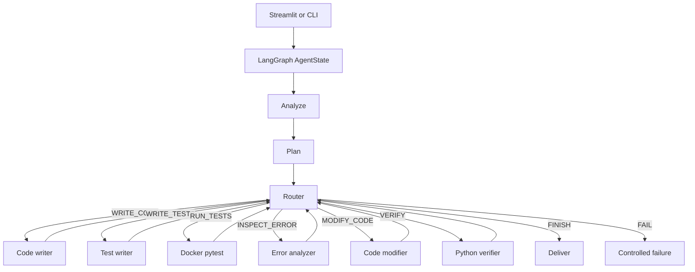

# CodePilot Agent

Autonomous code engineering system: **Goal → Plan → Act → Observe → Reason → Adapt → Verify → Deliver**.

LLM: **Groq**. Generated code runs in isolated virtual environments.

## Architecture



Details: [docs/ARCHITECTURE.md](docs/ARCHITECTURE.md), [docs/SECURITY.md](docs/SECURITY.md), [docs/LIMITATIONS.md](docs/LIMITATIONS.md).

## Observability (Optional)

CodePilot integrates with **LangSmith** for detailed tracing and observability. This is completely optional - the agent works perfectly without LangSmith.

### Enable LangSmith Tracing

1. Get a LangSmith API key from [smith.langchain.com](https://smith.langchain.com)
2. Add to your `.env` file:
```env
LANGCHAIN_TRACING_V2=true
LANGCHAIN_API_KEY=your_langsmith_api_key
LANGCHAIN_PROJECT=codepilot-agent
LANGCHAIN_ENDPOINT=https://api.smith.langchain.com
```

### What LangSmith Traces

- Complete agent workflow (analyze → plan → route → tools → deliver)
- LLM calls with model, latency, and token usage
- Tool invocations with inputs/outputs and duration
- Agent iterations and recovery patterns
- Execution results and verification status
- Failures with error types and context

### Graceful Degradation

If LangSmith is unavailable or disabled, the agent continues functioning normally with local logging only.

## Setup

```powershell
python -m venv .venv
.\.venv\Scripts\Activate.ps1
python -m pip install -r requirements.txt
copy .env.example .env
docker build -t codepilot-sandbox:latest -f Dockerfile.sandbox .
```

Set `GROQ_API_KEY` in `.env`. Keep `MAX_ITERATIONS=8`.

## Demo workflow

1. Start FastAPI backend: `uvicorn app.api.main:app --reload --port 8000`
2. Start Streamlit UI: `streamlit run ui/streamlit_app.py`
3. Load the **Add two integers** example (or paste a task).
4. Run agent. Expected trace: analyzed → plan → code → tests → venv pytest → verified.
5. Optional CLI: `python -m app.agent.run "Write a Python function add(a, b) that returns the sum of two integers."`

**With LangSmith tracing** (optional):
- Set `LANGCHAIN_TRACING_V2=true` in `.env`
- View traces at [smith.langchain.com](https://smith.langchain.com)

To record a demo: capture that Streamlit run; do not claim features the trace did not show.

## Tests

```powershell
python -m pytest tests/unit
python -m evaluation.evaluate --dry-run
```

Live hidden-test eval (writes `evaluation/last_run.json` only after a real run):

```powershell
python -m evaluation.evaluate --limit 2
```

There are **no** success-rate numbers in this README. They appear only in `last_run.json` after `evaluate.py` executes.

## Contest mapping

| Requirement | Component |
| --- | --- |
| 1 Accept a user goal | Streamlit form or `python -m app.agent.run` |
| 2 Break into steps | `planner` → `Plan` |
| 3 LLM / policy selects next action | Groq `AgentDecision` plus Python `constrain_decision` |
| 4 Execute tools | writers, Docker executor, error analyzer, modifier, verifier |
| 5 Maintain state | LangGraph `AgentState` |
| 6 Return a final result | `final_answer`, code, tests, sandbox results, verification, trace |

## Security (short)

Sandbox isolation, no host `exec`, no secrets in the container, static import/`open`/`eval` guards, clipped inputs, redacted logs. Full list: [docs/SECURITY.md](docs/SECURITY.md).
