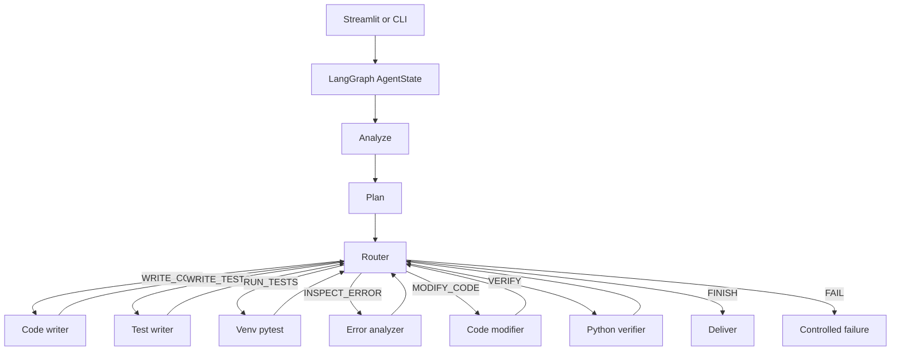

# CodePilot Agent

An autonomous code engineering system that transforms natural language requirements into verified, tested Python implementations through an intelligent **Goal → Plan → Act → Observe → Reason → Adapt → Verify → Deliver** workflow.

## Problem Statement

Developers spend significant time on repetitive coding tasks: writing boilerplate code, creating test suites, debugging failures, and ensuring edge cases are handled. Traditional coding assistants only provide snippets without full context, validation, or verification. The challenge isn't just generating code—it's ensuring that code is correct, tested, and production-ready.

## Overview

CodePilot Agent is an intelligent autonomous system that addresses the full engineering lifecycle:

- **Understands** natural language requirements and converts them into structured implementation plans
- **Generates** complete, tested Python code with proper error handling and edge case coverage  
- **Validates** code through automated testing in isolated virtual environments
- **Diagnoses** and fixes failures automatically through iterative debugging
- **Verifies** solutions against original requirements before delivery

Unlike traditional code completion tools, CodePilot doesn't just suggest code—it engineers complete solutions from requirements to verified implementation.

## Why I Built This

I built CodePilot to solve the **full-stack coding problem** - not just code generation, but the entire engineering lifecycle:

1. **End-to-End Automation**: From requirement to verified solution in one workflow
2. **Self-Correcting**: The agent learns from its own failures and iterates to fix them
3. **Safe Execution**: Generated code runs in isolated virtual environments, never on your host system
4. **Observable**: Full tracing and logging to understand the agent's decision-making process
5. **Architecture Preservation**: The agent's design follows established software engineering principles

I wanted to demonstrate that AI agents can move beyond simple code completion to become true engineering partners that understand requirements, make architectural decisions, write comprehensive tests, and ensure quality—all while maintaining the transparency and control that developers need.

## Use Cases

**For Developers:**
- Rapid prototyping of new features
- Automated test generation for existing code
- Code refactoring with guaranteed test coverage
- Edge case identification and handling

**For Teams:**
- Consistent code quality standards
- Automated code review assistance
- Onboarding new developers with example implementations
- Documentation generation from code

**For Learning:**
- Understanding best practices in Python development
- Learning test-driven development patterns
- Exploring different approaches to problem-solving

## Architecture

CodePilot follows a **graph-based agent architecture** built on LangGraph:



**Key Components:**
- **LangGraph State Machine**: Orchestrates the agent workflow and maintains state
- **Tool Functions**: Specialized tools for analysis, planning, code generation, testing, debugging
- **Virtual Environment Sandbox**: Isolated execution environment for generated code
- **LLM Integration**: Groq API for intelligent decision-making and code generation
- **Observability Layer**: LangSmith integration for detailed tracing and debugging

## Tech Stack

**Core Framework:**
- **Python 3.11+** - Main implementation language
- **LangGraph** - Agent workflow orchestration and state management
- **LangChain** - LLM integration and structured outputs
- **Groq API** - Fast LLM inference (mixtral-8x7b-32768 model)

**Backend:**
- **FastAPI** - REST API server for agent execution
- **Uvicorn** - ASGI server for FastAPI
- **Pydantic** - Data validation and settings management

**Frontend:**
- **Streamlit** - Interactive web UI for agent interaction

**Testing & Execution:**
- **pytest** - Test framework for generated code
- **Virtual Environments** - Isolated execution sandbox
- **Python venv** - Environment isolation without Docker

**Observability:**
- **LangSmith** - Optional tracing and monitoring
- **Python logging** - Local operational logging

**Development:**
- **pytest** - Unit and integration testing
- **Type hints** - Code clarity and IDE support

## Future Improvements

**Short-term (Q4 2026):**
- **Multi-language Support**: Extend beyond Python to JavaScript, TypeScript, and Go
- **Advanced Debugging**: Enhanced error analysis with automated pattern recognition
- **Code Review Integration**: GitHub/GitLab integration for pull request suggestions
- **Performance Optimization**: Faster virtual environment setup and caching

**Medium-term (2027):**
- **Context-Aware Coding**: Analyze existing codebases for style and pattern consistency
- **Collaborative Features**: Multi-user sessions and shared agent workspaces
- **Enhanced Security**: Static analysis integration for security vulnerability detection
- **API Generation**: Automatic REST API creation from business logic

**Long-term Vision:**
- **Full-Stack Development**: Generate both backend and frontend code together
- **Database Integration**: Automated schema design and ORM generation
- **Deployment Automation**: CI/CD pipeline generation and cloud deployment
- **Learning System**: Agent that improves from feedback across many codebases

## How to Run the Project

### Prerequisites

- Python 3.11 or higher
- pip (Python package manager)
- Groq API key (free at [console.groq.com](https://console.groq.com))

### Setup

```powershell
# Clone the repository
git clone <repository-url>
cd copilot-ai

# Create virtual environment
python -m venv .venv
.\.venv\Scripts\Activate.ps1

# Install dependencies
python -m pip install -r requirements.txt

# Configure environment
copy .env.example .env
# Edit .env and add your GROQ_API_KEY
```

### Running the Application

**Option 1: FastAPI Backend + Streamlit UI (Recommended)**

```powershell
# Terminal 1: Start FastAPI backend
uvicorn app.api.main:app --reload --port 8000

# Terminal 2: Start Streamlit UI
streamlit run ui/streamlit_app.py
```

**Option 2: CLI Interface**

```powershell
python -m app.agent.run "Write a Python function add(a, b) that returns the sum of two integers."
```

**Option 3: With LangSmith Observability (Optional)**

```powershell
# Add to .env file:
LANGCHAIN_TRACING_V2=true
LANGCHAIN_API_KEY=your_langsmith_api_key
LANGCHAIN_PROJECT=codepilot-agent
```

### Testing

```powershell
# Run unit tests
python -m pytest tests/unit

# Run evaluation (dry run)
python -m evaluation.evaluate --dry-run

# Run limited evaluation
python -m evaluation.evaluate --limit 2
```

## Observability (Optional)

CodePilot integrates with **LangSmith** for detailed tracing and observability. This is completely optional - the agent works perfectly without LangSmith.

### Enable LangSmith Tracing

1. Get a LangSmith API key from [smith.langchain.com](https://smith.langchain.com)
2. Add to your `.env` file:
```env
LANGCHAIN_TRACING_V2=true
LANGCHAIN_API_KEY=your_langsmith_api_key
LANGCHAIN_PROJECT=codepilot-agent
LANGCHAIN_ENDPOINT=https://api.smith.langchain.com
```

### What LangSmith Traces

- Complete agent workflow (analyze → plan → route → tools → deliver)
- LLM calls with model, latency, and token usage
- Tool invocations with inputs/outputs and duration
- Agent iterations and recovery patterns
- Execution results and verification status
- Failures with error types and context

### Graceful Degradation

If LangSmith is unavailable or disabled, the agent continues functioning normally with local logging only.

## Security

**Sandbox isolation**: Generated code runs in isolated virtual environments, never on the host Python interpreter. The system includes static import/`open`/`eval` guards, input clipping, and log redaction to prevent security issues.

For detailed security information, see [docs/SECURITY.md](docs/SECURITY.md).


